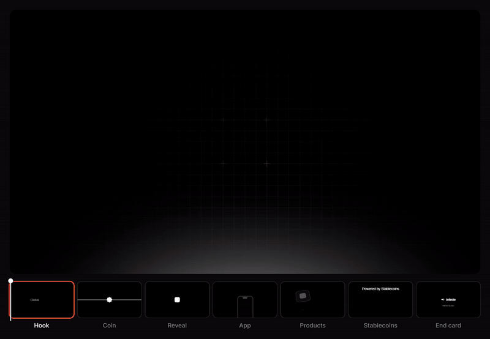
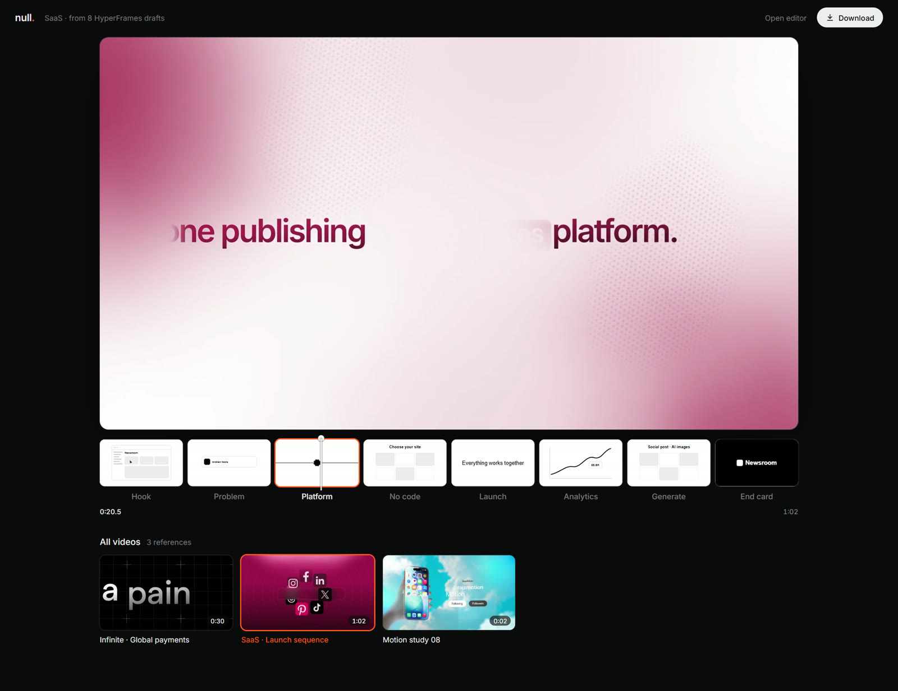
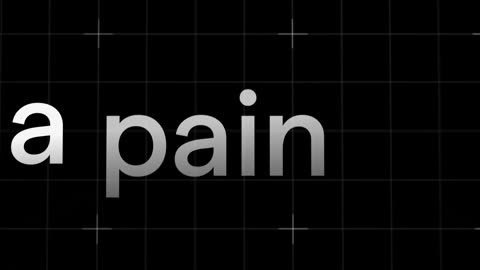
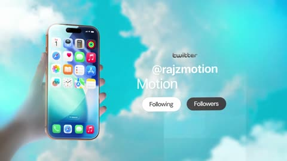
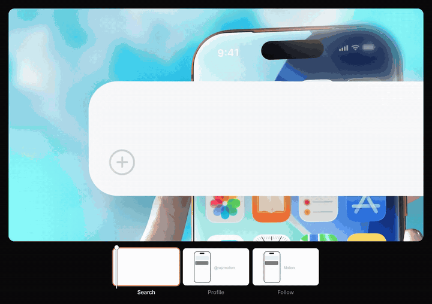

<p align="center">
  
</p>

<h1 align="center">Null Motion</h1>

<p align="center">
  <b>Null Studio</b> cuts pauses, captions the words, and turns long videos into vertical clips. You review the edit on a timeline.<br>
  <a href="https://www.nullmotion.com/">nullmotion.com</a>
  · <a href="https://www.nullmotion.com/mcp">Edit with Claude, Codex, or Cursor</a>
  · <a href="https://www.nullmotion.com/youtube-clip-maker">YouTube</a>
  · <a href="https://www.nullmotion.com/twitch-clip-maker">Twitch</a>
  · <a href="https://www.nullmotion.com/kick-clip-maker">Kick</a>
</p>

<p align="center">
  <b>From rough drafts to a finished ad.</b><br>
  A finished motion-graphics ad plays on top. Underneath: the simple black-and-white<br>
  HyperFrames drafts it grew from, one per section, in sync with the film.
</p>

<p align="center">
  
  
  
  
</p>

<p align="center">
  
</p>

---

## What it does

Every great ad starts as a rough draft. Null shows both at once:

- **The final film on top.** The full ad, full width, playing on a loop.
- **Its drafts underneath.** Each section (Hook, Reveal, App, End card…) has a plain HyperFrames scene: black and white, Arial type, flat shapes, one simple move. It shows the idea before the polish.
- **Everything in sync.** A playhead runs across the drafts. The draft for the section on screen follows the film frame for frame and gets an orange outline. The others keep looping their own part.
- **One-click export.** **Download → Whole preview** renders the film and its drafts frame by frame into a smooth, high-bitrate MP4 with the film's audio.

<p align="center">
  
</p>

## Showcase

The repo ships three references with their drafts, ready to play:

| | Reference | Length | Drafts |
|---|---|---|---|
|  | **Infinite · Global payments** | 0:30 | 7 |
|  | **SaaS · Launch sequence** | 1:02 | 8 |
|  | **Motion study 08** | 0:03 | 3 |

<p align="center">
  
</p>

These clips come from other creators and are used as examples. They are not claims of commissioned work.

## Quick start

```sh
git clone https://github.com/blixvip/NullMotion.git
cd NullMotion
npm start
```

Open **<http://127.0.0.1:4343>**. You need only Node.js 22 or newer: there's nothing to install and no keys to configure. Export needs Chrome or Edge (WebCodecs).

## How it works

1. **Sections.** `scripts/plan-sections.mjs` splits each reference into 3–8 sections at real scene changes (FFmpeg scene detection) and keeps every cut. Two-beat drafts switch at the exact moment the film cuts.
2. **Drafts.** `public/drafts.mjs` is a small HyperFrames engine: each draft is a 640×360 HTML scene on a paused GSAP timeline. A section is described by one or two *beats* (`text`, `logo`, `phone`, `window`, `input`, `chat`, `cards`, `list`, `chart`, `cloud`…), written to match the real frame's layout, text and timing.
3. **Playback.** The page drives every draft's timeline from the film's clock. The active section follows the film, and the others loop.
4. **Export.** A hidden copy of the film plays at half speed. `requestVideoFrameCallback` captures every decoded frame, the drafts are drawn at that frame's exact time, and WebCodecs encodes it at 24 Mbps with the frame's own timestamp. The audio is copied from the reference, and [mp4-muxer](https://github.com/Vanilagy/mp4-muxer) writes the MP4. Nothing is recorded in real time, so no frames are dropped.

## Bring your own references

With Python, FFmpeg and ffprobe installed:

```sh
python scripts/import-motionclone.py --source /path/to/MotionClone
node scripts/plan-sections.mjs      # sections + scene cuts + contact sheets
```

Imported media stays local in `.local-media/` and `public/references/` (both ignored by Git) and takes precedence over the showcase. Describe each section's beats in `public/references/drafts.json`. Undescribed sections get placeholder drafts. `npm run showcase` rebuilds `showcase/` from the local library.

The importer creates non-destructive segments, extracts thumbnails, and links the source videos. Original files are read only. The server streams byte ranges, so seeking never reads a whole video into memory. The optional `PORT` and `HOST` environment variables change the bind address.

## Project layout

```
public/demo.html · demo.mjs · demo.css   the preview page and exporter
public/drafts.mjs                        HyperFrames draft engine (beat kinds)
public/scraps.mjs                        hand-built drafts for the Interface reference
public/editor.*                          the earlier launch editor, at /editor
showcase/                                the three published references
scripts/                                 import, sections, showcase, waveforms, checks
server.js · media.js                     static server, media streaming, audio extraction
test/                                    server, media and editor tests
```

```sh
npm run dev     # restart on change
npm run check   # UI file checks
npm test        # node --test
```

## Notes

- The browser only calls this project's own origin. Generation, rendering services and Premiere are not connected. The drafts are authored, not AI-generated.
- The earlier launch editor (reference timeline, trimming, brand overlay) is at `/editor`, and the original Null Motion template gallery is at `/index.html`.
- Bundled GSAP and mp4-muxer keep their licenses; see [THIRD_PARTY_NOTICES.md](THIRD_PARTY_NOTICES.md). Brand artwork and reference footage belong to their respective owners. No project-wide open-source license has been selected.
