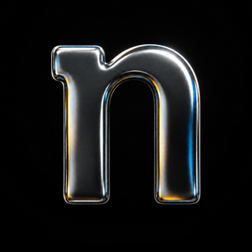
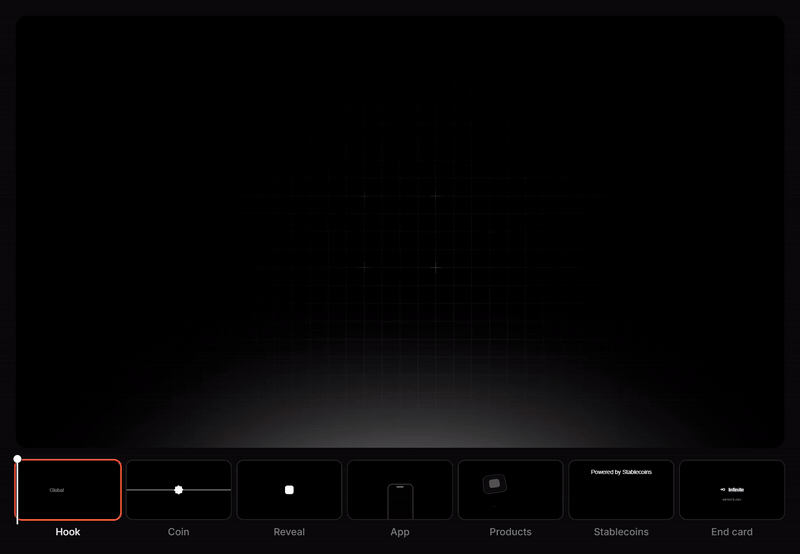
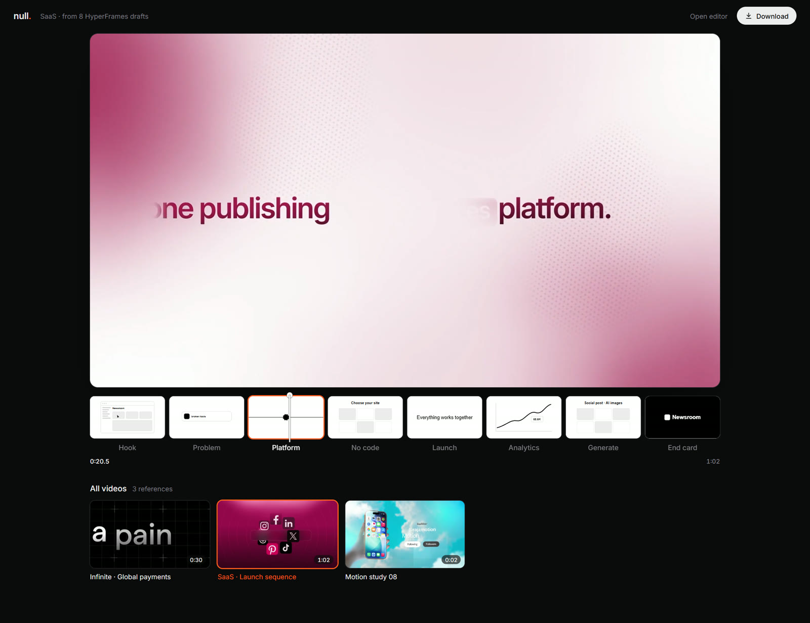
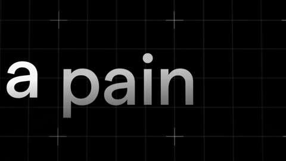
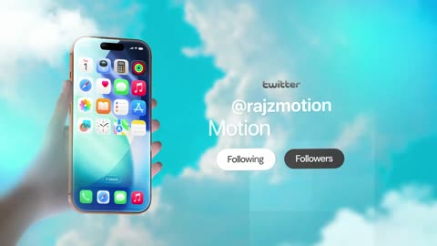
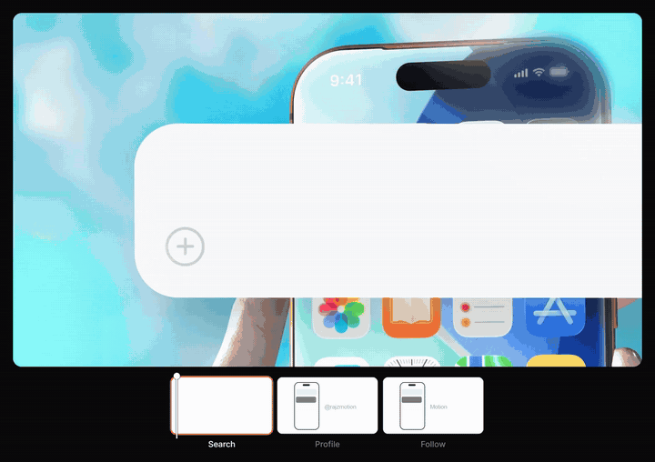

<p align="center">
  
</p>

<h1 align="center">Null Motion</h1>

<p align="center">
  <b>Watch a finished motion-graphics ad play over the rough drafts it grew from, frame-synced.<br>Then export the whole breakdown as one MP4.</b>
</p>

<p align="center">
  <a href="https://discord.gg/zEB4VjmfSb"></a>
</p>

<p align="center">
  <a href="https://github.com/blixvip/NullMotion/stargazers"></a>
  <a href="https://github.com/blixvip/NullMotion/releases"></a>
  
  
  
</p>

<p align="center">
  
</p>

<p align="center">
  <sub>Top: the finished ad. Bottom: one plain black-and-white HyperFrames draft per section. The playhead and the orange outline follow the film frame for frame.</sub>
</p>

## Quick start

```sh
git clone https://github.com/blixvip/NullMotion.git && cd NullMotion   # 1. get it
npm start                                                              # 2. run it (Node 22+, nothing to install)
```

3. Open **<http://127.0.0.1:4343>**, pick a reference, and press **Download → Whole preview** (Chrome or Edge) to get the MP4.

No `npm install`, no API keys, no account. Three references ship with the repo, so it works on the first run.

> **Not the same as Null Studio.** This repo is the free, local launch-film preview. Pause cuts, captions, and YouTube, Twitch, and Kick clips are **Null Studio**, a separate hosted product at [nullmotion.com](https://www.nullmotion.com/). They are not in this code.

<p align="center">
  <a href="#what-it-does">What it does</a> ·
  <a href="#showcase">Showcase</a> ·
  <a href="#how-it-works">How it works</a> ·
  <a href="#bring-your-own-references">Bring your own references</a> ·
  <a href="#faq-and-troubleshooting">FAQ</a> ·
  <a href="#project-layout">Project layout</a> ·
  <a href="#contributing">Contributing</a> ·
  <a href="#community">Community</a>
</p>

---

## What it does

Motion-graphics ads look effortless, but every one starts as a rough plan: which idea goes in which section, and when each move lands. Null Motion puts that plan and the finished film side by side, so you can study how a great ad is built, pitch a concept, or export the whole breakdown as one video.

- **The final film on top.** The full ad, full width, playing on a loop.
- **Its drafts underneath.** Each section (Hook, Reveal, App, End card…) has a plain HyperFrames scene: black and white, Arial type, flat shapes, one simple move. It shows the idea before the polish.
- **Everything in sync.** A playhead runs across the drafts. The draft for the section on screen follows the film frame for frame and gets an orange outline. The others keep looping their own part.
- **One-click export.** **Download → Whole preview** renders the film and its drafts frame by frame into a 1920-wide, 24 Mbps MP4 with the film's audio.

<p align="center">
  
</p>

## Showcase

The repo ships three references with their drafts, ready to play:

| | Reference | Length | Drafts |
|---|---|---|---|
|  | **Infinite · Global payments** | 0:30 | 7 |
|  | **SaaS · Launch sequence** | 1:02 | 8 |
|  | **Motion study 08** | 0:03 | 3 |

<p align="center">
  
</p>

These clips come from other creators and are used as examples. They are not claims of commissioned work.

### 🎬 Show what you made

Exported a breakdown or built drafts for your own ad? Post it in the **[Discord](https://discord.gg/zEB4VjmfSb)**. We'd love to see it.

## How it works

1. **Sections.** `scripts/plan-sections.mjs` splits each reference into 3–8 sections at real scene changes (FFmpeg scene detection) and keeps every cut. Two-beat drafts switch at the exact moment the film cuts.
2. **Drafts.** `public/drafts.mjs` is a small HyperFrames engine: each draft is a 640×360 HTML scene on a paused GSAP timeline. A section is described by one or two *beats* (`text`, `logo`, `phone`, `window`, `input`, `chat`, `cards`, `list`, `chart`, `cloud`…), written to match the real frame's layout, text and timing.
3. **Playback.** The page drives every draft's timeline from the film's clock. The active section follows the film, and the others loop.
4. **Export.** A hidden copy of the film plays at half speed. `requestVideoFrameCallback` captures every decoded frame, the drafts are drawn at that frame's exact time, and WebCodecs encodes it at 24 Mbps with the frame's own timestamp. The audio is copied from the reference, and [mp4-muxer](https://github.com/Vanilagy/mp4-muxer) writes the MP4. Nothing is recorded in real time, so no frames are dropped.

### Requirements

| | Needed for |
|---|---|
| **Node.js 22+** | Running the local server (`npm start`). No dependencies to install. |
| **Chrome or Edge** | MP4 export (WebCodecs + `requestVideoFrameCallback`). Playback works in any modern browser. |
| **FFmpeg / ffprobe** (optional) | Importing your own references, planning sections, rebuilding the showcase, and extracting audio for imported references. |
| **Python 3** (optional) | `scripts/import-motionclone.py`. |

## Bring your own references

With Python, FFmpeg and ffprobe installed:

```sh
python scripts/import-motionclone.py --source /path/to/MotionClone
node scripts/plan-sections.mjs      # sections + scene cuts + contact sheets
```

Imported media stays local in `.local-media/` and `public/references/` (both ignored by Git) and takes precedence over the showcase. Describe each section's beats in `public/references/drafts.json`. Undescribed sections get placeholder drafts. `npm run showcase` rebuilds `showcase/` from the local library.

The importer creates non-destructive segments, extracts thumbnails, and hard-links the source videos when they are on the same drive as this repo (otherwise it copies them). Original files are only read. The server streams byte ranges, so seeking never reads a whole video into memory.

## FAQ and troubleshooting

**The Download button says "Needs Chrome or Edge".**
Export uses WebCodecs and `requestVideoFrameCallback`. Use a current Chrome or Edge. Firefox and Safari can play the preview but can't export.

**How long does an export take?**
The film is rendered at half speed so no frame is skipped, so expect it to take at least twice the film's length (a minute or more for the 30-second Infinite ad). Keep the tab in front while it renders, because browsers slow down video in background tabs.

**My export has no sound.**
The showcase ships its audio. For your own imported references the server extracts the audio with FFmpeg on first export, so FFmpeg must be on your `PATH`.

**The import failed with "Invalid cross-device link" (EXDEV).**
Older versions only hard-linked videos, which only works on one drive. Pull the latest `main`: the importer now copies the video when a link isn't possible. A copy uses extra disk space, so keep MotionClone on the same drive as this repo if space is tight.

**"No data/ folder in …" when importing.**
`--source` must point at the MotionClone project folder (the one that contains `data/`), not at a single video.

**Port 4343 is already in use, or I want to open it from another device.**
Set `PORT` and/or `HOST`, for example `PORT=5000 npm start` or `HOST=0.0.0.0 npm start` (default `127.0.0.1:4343`).

**The template gallery or editor says "generation not connected".**
That's intentional. Generation, rendering services, and Premiere are not connected in this repo, and the server answers those calls with `501 NOT_CONNECTED`. The drafts are authored, not AI-generated.

**Can I make vertical clips, cut pauses, or add captions with this?**
No. Those are features of Null Studio at [nullmotion.com](https://www.nullmotion.com/), a separate hosted product.

Stuck on something else? Ask in the **[Discord](https://discord.gg/zEB4VjmfSb)** or [open an issue](https://github.com/blixvip/NullMotion/issues/new/choose).

## Project layout

```
public/demo.html · demo.mjs · demo.css   the preview page and exporter
public/drafts.mjs                        HyperFrames draft engine (beat kinds)
public/scraps.mjs                        hand-built drafts for the Interface reference
public/editor.*                          the earlier launch editor, at /editor
showcase/                                the three published references
scripts/                                 import, sections, showcase, waveforms, checks
server.js · media.js                     static server, media streaming, audio extraction
test/                                    server, media and editor tests
```

```sh
npm run dev     # restart on change
npm run check   # UI file checks
npm test        # node --test
```

## Notes

- The browser only calls this project's own origin.
- The earlier launch editor (reference timeline, trimming, brand overlay) is at `/editor`, and the original Null Motion template gallery is at `/index.html`.
- Bundled GSAP and mp4-muxer keep their licenses; see [THIRD_PARTY_NOTICES.md](THIRD_PARTY_NOTICES.md). Brand artwork and reference footage belong to their respective owners. No project-wide open-source license has been selected.

## Contributing

Bug reports, draft ideas, and pull requests are welcome. See [CONTRIBUTING.md](CONTRIBUTING.md) for setup and checks. For questions, the [Discord](https://discord.gg/zEB4VjmfSb) is the fastest place to ask.

## Community

<p align="center">
  <a href="https://discord.gg/zEB4VjmfSb"></a>
</p>

💬 Questions, help, feedback, release news, and your renders all go in **[Insider AI on Discord](https://discord.gg/zEB4VjmfSb)**. If Null Motion helped you, a ⭐ helps other people find it.
